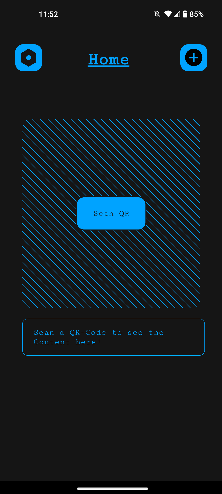
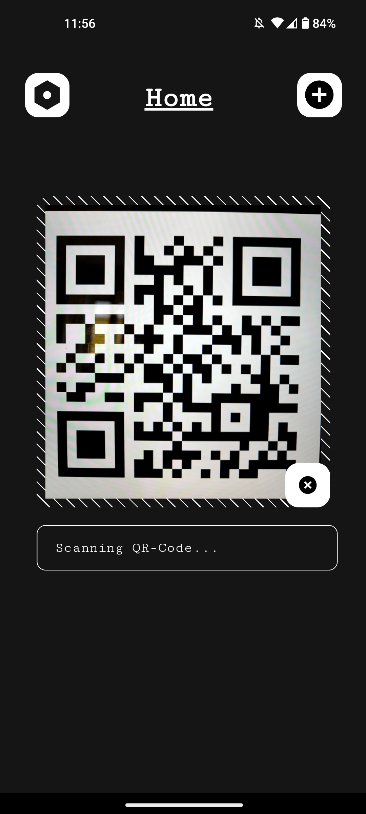

# QR-Code Sc4nner

This project is a simple QR-Code Scanner which can be installed on your smartphone as a PWA (**P**rogressive **W**eb **A**pp) or used via your preferred browser. It can also be installed on your computer, but make sure the aspect ratio (Portrait) fits the apps needs.

## 🔱 Install as PWA

To be able to install the `QR-Code Sc4nner`, simply head to [qr.p4s3r0.com](https://qr.p4s3r0.com) and a installation prompt should be shown. If no installation hint appears, click More (3 dots on the right top) and press on `Install App`. For further instructions get help [here](https://support.google.com/chrome/answer/9658361?hl=en&co=GENIE.Platform%3DDesktop&sjid=2917438543024608580-EU)

## 🎭 Features

- QR-Code Scan: Scan a QR-Code and display it's content
- Change Themeing: Change the main colors of the app

## 📷 Screenshots

**16** different colors to choose from.

Home Screen             |  Scanning | After Scan 
:-------------------------:|:-------------------------:|:-------------------------:
|   |   |  |
|   |   |  |
|   |   |  |
